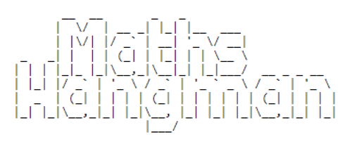
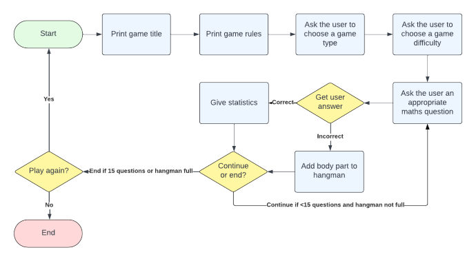
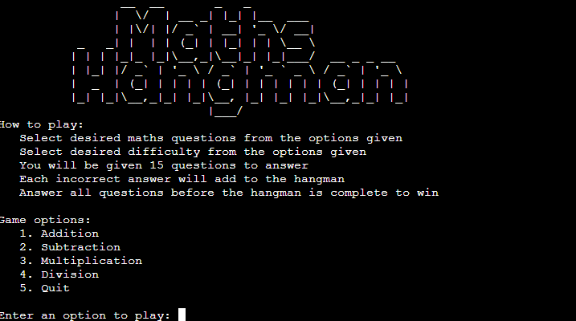
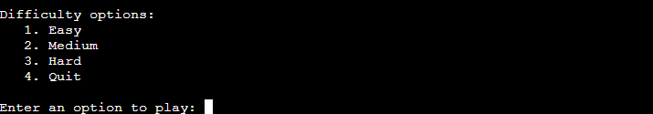
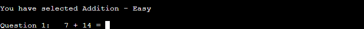
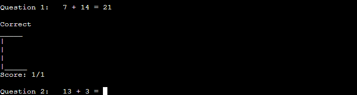
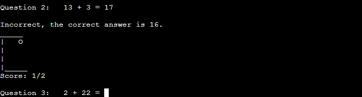
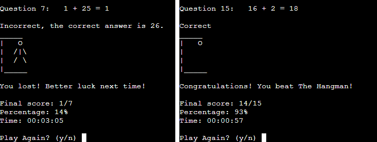
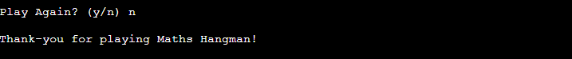
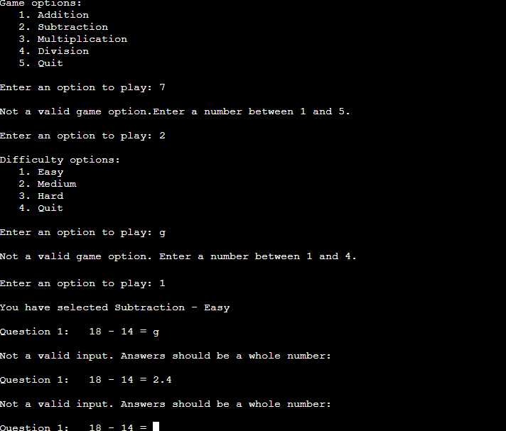

# <h1 align="center">**MATHS HANGMAN**</h1>

[View the live project here](https://maths-hangman.herokuapp.com/)

    

Maths Hangman - A twist on the classic hangman game where maths questions are answered instead of guessing lessons.

## Objectives
The objective of the application is to provide a command line game of Maths Hangman that is deployed online via a 'mock terminal'. The application should provide clear instructions and feedback to the user, including validation of input from the user. The object of the game is to answer 15 maths questions and every incorrect answer adds a body part to the hangman. After 6 incorrect answers, the hangman is complete and the game is lost! 

### Visitor Goals

1. Enjoy a maths game that also helps improve maths skills.
2. Be provided clear instructions of how to play the game.
3. Have options on what type of maths questions will be given.
4. Have options on what difficulty the maths questions will be.
5. See feedback on current score and how full the hangman is.
6. Be informed if my input is not valid and be given the chance to try again.
7. Be given feedback at the end of the game of my performance.
8. Have the option to keep playing the game if desired.

### Flowchart
The following flow chart was used to map out the logic required to build the game and was invaluable in determining what loops and if statements were required for the game.

## Features
### Existing Features
#### Home Screen
At the start of the game users are presented with the game logo, the instructions on how to play the game, a list of game type options to choose from and a prompt to choose a game type. The game types are addition, subtraction, multiplication and division. The user can also choose to quit the game.

This addresses visitor goals 2 and 3.

#### Difficulty Choice
After a game type has been selected the user is presented with a list of difficulties to choose from and a prompt to choose a difficulty. The difficulties are easy, medium and hard. The user can also choose to quit the game.

This addresses visitor goal 4.

#### Game Play
After the game type and difficulty have been selected the user is given feedback of their choices and is given a maths question to answer based on these choices.

The user is then given feedback on their answer, the status of the hangman, their current score and the next question.

If the answer is correct the message "Correct" is given and no body parts are added to the hangman.

This addresses visitor goal 5.

If the answer is incorrect the message "Incorrect" is given along with the correct answer and a body part is added to the hangman.

This addresses visitor goal 5.

The game ends when either 15 questions have been answered or the hangman is full. If all 15 questions were answered a congratulations message is displayed. If the hangman was completed then a commiserations message is displayed. The user is then given their performance statistics as number of correct / total answers, percentage correct and time taken to complete the game.

This addresses visitor goal 7.

The user is then asked if they would like to play again. Responding 'y' will start the game again at the home screen. Responding 'n' will display a thank-you message and end the game.

This addresses visitor goal 8.

#### Input Validation
Throughout the game all input given by the user is validated. If the user enters data that is not valid they are given feedback on what should be entered and asked to try again.

This addresses visitor goal 6.

### Future Features
All originally planned features were successfully implemented

An additional feature that could be implemented would be an additional game type that is a mix of the mathematical operators.

## Languages and Libraries
- The game was created using Python
- The built-in python random and time modules were used.
- No external libraries were used.

## Testing
The game was built one feature at a time, with each feature being successfully tested without bugs before moving onto the next to slowly add the complexity to the game.

### Bugs
- When adding validation to the input for game type the game crashed if an invalid option was entered more than once. This was fixed by adding a while True loop to the try/except statement.
- The scores were given twice on the final question. This was fixed by adding an if statement to the game_play function to not display the score on the final question.
- Before deployment to Heroku '\n' was added to the input statements as recommended, but this meant that all inputs were entered onto a new line and ruined the aesthetics of the game. The '\n' was removed from the input statements and the game was tested to ensure no issues were present.
- During testing it was noted that the game does not respond to user input when used in Safari on iOS. This is due to a limitation of the mock terminal itself.
- No detected bugs have been left unresolved, but there is always the possibility of undetected bugs.

### Validator Testing
- The PEP8 online linter was not working during the project. As a workaround the PEP8 validator was added to the GitPod Workspace by running command pip3 install pycodestyle then searching for 'linter' and selecting 'Python: Select Linter' then 'pycodestyle'.
- The PEP8 linter detected numerous issues with the code relating to whitespace and lines being too long. These issues were fixed by deleting any whitespaces and changing the long lines to multi-line code.
- Numerous warnings about invalid escape sequences were given for the game title and hangman 'pictures'. These have been noted but ignored as they are strings printed to the terminal.

## Deployment
The GitHub repository was made using this [Code Institute Template](https://github.com/Code-Institute-Org/python-essentials-template) to allow the game to run in the 'mock terminal'. The game was then deployed to Heroku.

To deploy in Heroku:
- In [GitHub](https://github.com), fork or clone this [repository](https://github.com/Porsil/maths-hangman)
- Log in to [Heroku](https://www.heroku.com) (create an account if required)
- Click 'New' in the top right and select 'Create new app' 
- Enter a name for the app and select the appropriate region
- Select 'Create app'
- Select 'Settings' from the menu at the top
- Find the 'Config Vars' section and select 'Reveal Config Vars'
- Enter 'PORT' for the key and '8000' for the value, then select 'Add' to add a new Config Var
- Scroll down to the 'Buildpacks' section
- Select 'Add' and add the `Python' buildpack
- Select 'Add' again and add the 'NodeJS' buildpack
- The 'Python' buildpack must be above the 'NodeJS' buildpack
- Select 'Deploy' from the menu at the top
- Select 'GitHub' and confirm you wish to deploy using GitHub. Enter your GitHub password if prompted.
- Find the 'Connect to GitHub' section and search for your repository
- Select 'Connect' when found
- Option 1 - To automatically redeploy your app every time you push changes to GitHub: In the 'Automatic deploys' section add the 'main' branch to 'Choose a branch to deploy' and click 'Enable Automatic Deploys'
- Option 2 - To manually deploy your site: In the 'Manual Deploy' section add the 'main' branch to 'Choose a branch to deploy' and click 'Deploy Branch'
- Once your site is deployed you will be given a link to the app.

## Credits
### Code
- The deployment terminal was provided by Code Institute.
- The game inspiration and method for ensuring the division question generated a whole number was taken from the [Code Institute Love Maths Walkthrough](https://github.com/Code-Institute-Org/love-maths).
- The ASCII art title was generated using [Patorjk](https://patorjk.com/software/taag/#p=display&f=Standard&t=%20%20%20%20%20%20Maths%0AHangman)
- The game stopwatch was made by adapting code from this [CodeSpeedy post](https://www.codespeedy.com/how-to-create-a-stopwatch-in-python/) and this [Stack Overflow question](https://stackoverflow.com/questions/3505831/in-python-how-do-i-convert-a-single-digit-number-into-a-double-digits-string)
