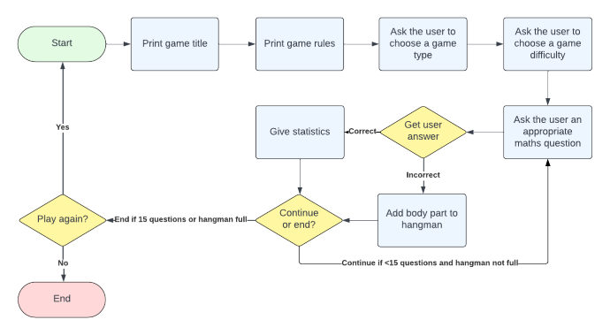

# <h1 align="center">**MATHS HANGMAN**</h1>

[View the live project here](https://maths-hangman.herokuapp.com/)

This is terminal game of Maths Hangman. A twist on the classic hangman game where maths questions are answered instead of guessing lessons.

## Objectives
The objective of the application is to provide a command line game of Maths Hangman that is deployed online via a 'mock terminal'. The application should provide clear instructions and feedback to the user, including validation of imput from the user. The object of the game is to answer 15 maths questions and every incorrect answer adds a body part to the hangman. After 6 incorrect answers, the hangman is complete and the game is lost! 

### Visitor Goals

1. Enjoy a maths game that also helps improve maths skills.
2. Be provided clear instructions of how to play the game.
3. Have options on what type of maths questions will be given.
4. Have options on what difficulty the maths questions will be.
5. See feedback on current score and how full the hangman is.
6. Be informed if my input is not valid and be given the chance to try again.
7. Be given feedback at the end of the game of my performance.
8. Have the option to keep playing the game if desired.

### Flowchart

## Features

